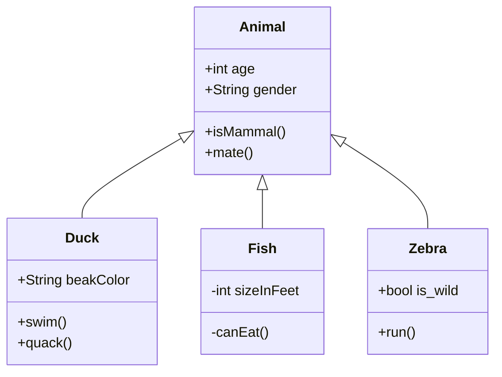
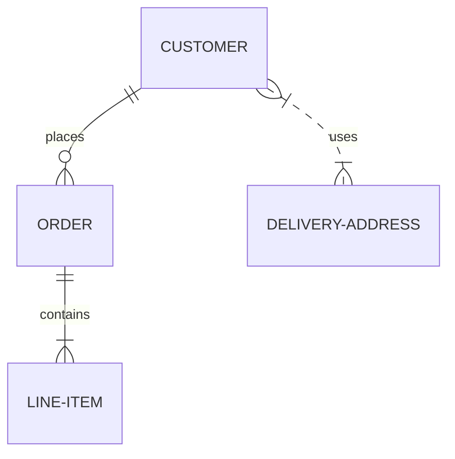
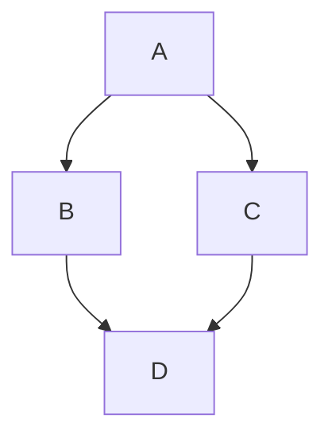

# Mermaid Test

This file contains various Mermaid diagrams for testing.

## Class Diagram



## Entity Relationship Diagram



## Regular Code Block

This should not be converted:

```python
print("Hello World")
```

## Another Mermaid Diagram

